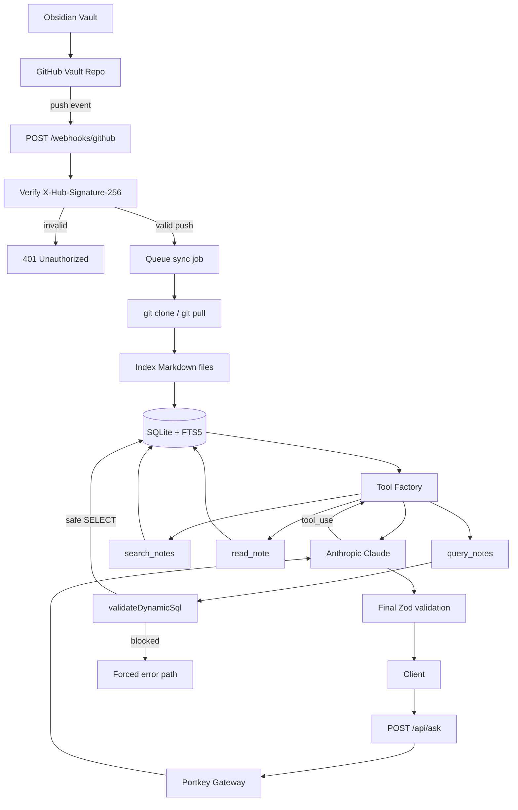

# CTF Copilot API
The service turns a GitHub-synced Obsidian vault into an AI service:

- GitHub webhook syncs your Obsidian vault into a local cache.
- Markdown notes are indexed into SQLite/FTS5.
- `/api/ask` calls Claude through Portkey.
- Claude can use tools over your own indexed notes.
- Every request, tool input, tool output, and final answer is validated.
- Generated SQL is treated as untrusted and passed through a lexical guardrail.
- Final responses are schema-valid JSON with a forced error path.

---

## Assignment mapping

| Requirement | Where implemented |
|---|---|
| Example 6: Portkey gateway, virtual key/provider slug, per-user metadata, model swap | `src/ai/portkeyClient.ts`, `.env` |
| Example 3: structured output, `shouldContinue`, Zod validation | `src/schemas/finalAnswer.ts`, `src/ai/claudeRunner.ts`, `src/routes/ask.ts` |
| Example 2: tool factory + `ToolContext` | `src/tools/toolFactory.ts`, `src/tools/ToolContext.ts` |
| Example 5: `validateDynamicSql`, strip-before-check, denylist, adversarial tests | `src/guardrails/validateDynamicSql.ts`, `tests/sqlGuardrail.test.ts` |
| Own data | GitHub-synced Obsidian vault indexed into SQLite/FTS5 |
| Gateway routed Anthropic/Claude | Portkey `/v1/messages` route |
| Forced error path | `forcedErrorPath()` in `src/schemas/finalAnswer.ts` |
| Guardrail blocks malicious generated query | `query_notes` tool + tests |

---

## Architecture



---

## API

### `GET /health`

```json
{ "ok": true }
```

### `POST /webhooks/github`

GitHub calls this when your vault repository receives a push.

Security:

- Requires `X-Hub-Signature-256`.
- Verifies HMAC-SHA256 with `GITHUB_WEBHOOK_SECRET`.
- Accepts only `push` events.
- Returns quickly with `202`; sync runs in the internal queue.

### `POST /api/sync`

Manual fallback sync for local demos and debugging.

```json
{
  "ok": true,
  "source": "manual",
  "commitSha": "...",
  "changedFiles": ["apk-analysis.md"],
  "indexed": {
    "indexedDocuments": 1,
    "indexedChunks": 4,
    "skippedUnchanged": 12
  }
}
```

### `GET /api/index/status`

```json
{
  "documents": 12,
  "chunks": 94,
  "lastIndexedAt": "2026-07-07T12:00:00.000Z"
}
```

### `POST /api/ask`

Request:

```json
{
  "userId": "othmane",
  "question": "What do my notes say about APK dynamic analysis?",
  "mode": "research"
}
```

Successful response:

```json
{
  "shouldContinue": true,
  "answer": "Your notes recommend starting with static triage, then dynamic execution...",
  "sources": [
    {
      "title": "apk-analysis",
      "path": "Android/apk-analysis.md",
      "snippet": "Use jadx, apktool, MobSF..."
    }
  ],
  "toolCalls": ["search_notes", "read_note"],
  "blocked": false,
  "error": null
}
```

Blocked/error response:

```json
{
  "shouldContinue": false,
  "answer": null,
  "sources": [],
  "toolCalls": ["query_notes"],
  "blocked": true,
  "error": {
    "code": "GUARDRAIL_BLOCKED_SQL",
    "message": "The generated SQL was blocked by policy."
  }
}
```

---

## Quick start

### 1. Install

```bash
npm install
cp .env.example .env
```

### 2. Configure `.env`

For local testing without AI keys:

```env
AI_PROVIDER=mock
VAULT_REPO_URL=https://github.com/YOUR_USERNAME/YOUR_OBSIDIAN_VAULT.git
VAULT_BRANCH=main
```

For the real assignment demo:

```env
AI_PROVIDER=portkey
PORTKEY_API_KEY=pk-...
PORTKEY_PROVIDER=anthropic
AI_MODEL=@your-provider-slug/claude-sonnet-4-5-20250929
```

Portkey supports Anthropic's `/messages` route at `https://api.portkey.ai/v1/messages`. The model can be written as a provider slug/model pair such as `@your-provider-slug/claude-...`.

### 3. Run

```bash
npm run dev
```

### 4. Index data

For a quick local demo without GitHub:

```bash
npm run ingest:sample
```

For your real GitHub-synced Obsidian vault:

```bash
curl -X POST http://localhost:3000/api/sync
```

### 5. Ask a question

```bash
curl -X POST http://localhost:3000/api/ask \
  -H "Content-Type: application/json" \
  -d '{
    "userId": "demo-user",
    "question": "What do my notes say about APK analysis?",
    "mode": "research"
  }'
```

---

## GitHub webhook setup

For local development:

```bash
ngrok http 3000
```

In your Obsidian vault GitHub repo:

```text
Settings -> Webhooks -> Add webhook
```

Use:

```text
Payload URL: https://YOUR_NGROK_URL/webhooks/github
Content type: application/json
Secret: same value as GITHUB_WEBHOOK_SECRET
Events: Just the push event
Active: yes
```

Then edit a note, push to GitHub, and check:

```bash
curl http://localhost:3000/api/index/status
```

---

## Tools

Claude receives three client tools.

### `search_notes`

Searches the SQLite FTS index.

Input:

```json
{ "query": "APK dynamic analysis", "limit": 5 }
```

### `read_note`

Reads one indexed Markdown note by vault-relative path.

Input:

```json
{ "path": "Android/apk-analysis.md" }
```

### `query_notes`

Runs a restricted read-only SQL query after guardrail validation.

Input:

```json
{ "sql": "SELECT title, path FROM documents WHERE content LIKE '%apk%' LIMIT 5" }
```

Blocked examples:

```sql
DROP TABLE documents;
SELECT * FROM documents; DELETE FROM documents;
SELECT * FROM documents UNION SELECT password FROM users;
SELECT load_extension('/tmp/x.so');
SELECT * FROM sqlite_master;
```

---

## Guardrail design

The SQL guardrail is intentionally lexical, matching the assignment requirements.

It does:

- strip comments before checks;
- normalize whitespace and case;
- enforce a single statement;
- allow only `SELECT`;
- block dangerous denylist terms;
- require known table names only;
- append a default `LIMIT` when missing.

Known limitation:

> This is not a semantic SQL parser. It catches common dangerous generated queries for low cost, but should be combined with database-level permissions, timeouts, cost checks, and rate limits in production.

This is the intended senior engineering trade-off: roughly 95% of practical safety for a small fraction of parser complexity.

---

## Testing

```bash
npm test
```

Included tests:

```text
- valid GitHub webhook signature accepted
- invalid/missing signature rejected
- Markdown chunking by headings
- SQL guardrail allows safe SELECT
- SQL guardrail blocks DROP/DELETE/UNION/PRAGMA/sqlite_master/load_extension
- final answer schema validates success and forced errors
```

---

## Deployment

### Option A: Docker on a VPS

```bash
cp .env.example .env
# edit .env

docker compose up -d --build
```

Requirements:

- public domain or public IP;
- open port 3000 or reverse proxy through Nginx/Caddy;
- Git installed in container;
- deploy key or HTTPS read token for private vault repo.

### Option B: Render/Fly/Railway

You can deploy this as a Node service, but make sure you persist:

```text
/app/data
/app/vault-cache
```

Without persistent storage, the service will re-clone and re-index after restarts.

### Production notes

Use:

```text
- HTTPS only
- long random GITHUB_WEBHOOK_SECRET
- read-only GitHub deploy key/token
- AI_PROVIDER=portkey
- PORTKEY metadata enabled
- reverse proxy body size limit
- rate limiting for /api/ask and /api/sync
```

---

## Demo script for submission

1. Show `.env` with secrets hidden.
2. Start the service.
3. Call `/health`.
4. Push a Markdown note to the Obsidian vault repo.
5. Show GitHub webhook delivery success.
6. Call `/api/index/status` and show updated document/chunk count.
7. Ask a normal question through `/api/ask`.
8. Show the schema-valid answer with sources and tool calls.
9. Ask a malicious query/request.
10. Show the forced blocked response.
11. Change `AI_MODEL` in `.env` and restart to demonstrate one-line model swap.

---

## Why this project satisfies the assignment

This project does not treat the model as magic. The model is a dependency behind a gateway and a strict application contract.

The app owns:

- routing;
- validation;
- tool execution;
- data access;
- error handling;
- guardrails;
- final response shape.

Claude only decides which tool to request and how to compose the final grounded answer.
